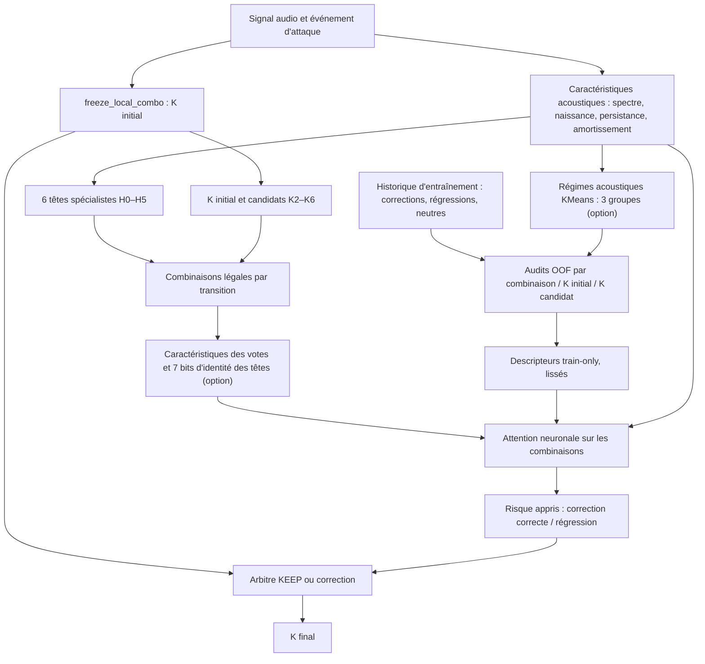

# README — Nouveau système neuronal Exact-K et blocages identifiés (V27.3)

> **Projet :** [Andriamarosoa/note](https://github.com/Andriamarosoa/note)  
> **Branche expérimentale :** `codex/v273-failure-clustering`  
> **État au 8 octobre 2026 :** développement et audits terminés pour les variantes décrites ci-dessous ; **aucune nouvelle variante promue**.  
> **Objectif :** améliorer fortement **Exact-K polyphonique (K2–K6)** avant l'identification des notes elles-mêmes, sans dégrader Exact-K global.

## 1. Résumé exécutif

Notre problème central n'est plus le nombre de têtes disponibles : **les nouvelles sélections savent exploiter certaines caractéristiques du signal et certains audits, mais elles ne distinguent pas assez bien une correction utile d'une modification destructrice**, surtout quand la prédiction de référence **K3 est déjà correcte**.

**Référence officielle gelée — `freeze_local_combo` :**

| Mesure | Valeur |
|---|---:|
| Événements natifs évalués (vrai K0 à K6) | **59 309** |
| Prédictions de référence admissibles à une correction (K2, K3 ou K4 prédit) | **7 493** |
| Événements réellement polyphoniques (vrai K2–K6) | **7 385** |
| Exact-K global | **81,6976 %** |
| Exact-K poly | **34,2586 %** |
| Folds actuellement exploités | **0, 1, 2, 4** |
| Non exploités dans cette cohorte | **fold 3 / player05** |

Le *K* de cet audit représente la cardinalité native attribuée à l'événement d'attaque ; il ne faut pas automatiquement l'assimiler au nombre de notes soutenues simultanément. Les caractéristiques analysées incluent jusqu'à **160 ms après l'attaque** : le système expérimental n'est donc pas, à ce stade, une prédiction causale instantanée.

### Situation du nouveau système

- **14 têtes logiques raccordées** à l'interface historique.
- **6 têtes de prédiction/caractéristiques** H0–H5.
- **4 têtes de transition** C23, C32, C34, C43, conditionnées par la direction.
- **4 têtes KEEP/fix** F_keep2, F_keep3, F_keep4, F_keep_any ; ce sont encore des **adaptateurs/prototypes**, pas le rejeu validé de tous les correcteurs historiques.
- Un **sélecteur neuronal conditionné par K initial, K proposé, acoustique et combinaison de têtes**.
- Un **arbitre appris** estime correction, régression et intérêt de KEEP.
- Nouveaux canaux expérimentaux : **identité explicite des têtes** et **audits OOF par régime acoustique**.

**Verdict :** l'implémentation fonctionne et les tests CI réussissent, mais **aucune des variantes ne bat `freeze_local_combo`** sur les folds étudiés. Ajouter des caractéristiques d'audit n'a pas suffi.

---

## 2. Objectif, périmètre et vocabulaire

**Exact-K global** : part des 59 309 événements pour lesquels le K prédit vaut le vrai K, parmi K0–K6.

**Exact-K poly** : exactitude sur les événements dont la vérité terrain est K2–K6 (7 385 événements), avec le même prédicteur global.

**KEEP** : action consistant à conserver le K du modèle gelé plutôt qu'à appliquer une correction.

**Correction** : événement initialement mal classé par `freeze_local_combo`, devenu correct.

**Régression** : événement initialement correct par `freeze_local_combo`, devenu incorrect.

**Net** : corrections − régressions, compté en nombre d'événements (pas en points de pourcentage).

**OOF / out-of-fold** : prédictions ou statistiques préparées sans utiliser directement les étiquettes du fold destinataire ; **attention :** l'indépendance intégrale des modèles produisant certaines représentations internes n'est pas encore entièrement garantie (voir § 7).

Le correcteur actuel ne peut modifier que les **7 493 prédictions de référence déjà annoncées comme K2/K3/K4**. Les autres événements restent inchangés.

---

## 3. Architecture : ancienne référence et nouveau routeur



### 3.1 Les 14 têtes logiques

| Tête | Fonction | État réel |
|---|---|---|
| **H0** | Référence / prédiction initiale ; repli structurel | Active |
| **H1** | Information spectrale | Active |
| **H2** | Cycle de vie du son | Active |
| **H3** | Information harmonique | Active |
| **H4** | Information de fondamentale | Active |
| **H5** | Information de sources / contrôles | Active |
| **C23** | Correction envisagée K2 → K3 | Adaptateur de correction |
| **C32** | Correction envisagée K3 → K2 | Adaptateur de correction |
| **C34** | Correction envisagée K3 → K4 | Adaptateur de correction |
| **C43** | Correction envisagée K4 → K3 | Adaptateur de correction |
| **F_keep2** | Indice de maintien d'un K2 | Adaptateur KEEP |
| **F_keep3** | Indice de maintien d'un K3 | Adaptateur KEEP |
| **F_keep4** | Indice de maintien d'un K4 | Adaptateur KEEP |
| **F_keep_any** | Indice général de conservation | Adaptateur KEEP |

**Important :** les 14 têtes ne participent pas toutes directement à chaque vote de K. Dans la version à sous-ensembles, seuls H0–H5 et **éventuellement une seule** tête Cxy propre à la transition composent la banque de sélection ; les autres adaptateurs contribuent notamment aux caractéristiques KEEP. Les correcteurs Cxy et F_keep ne constituent pas le déploiement effectif de toutes les anciennes pistes testées.

### 3.2 Pourquoi 127 combinaisons théoriques, mais 64 utilisables ?

Pour 7 têtes compatibles, le nombre de sous-ensembles non vides vaut :

```text
2^7 - 1 = 127 combinaisons théoriques.
```

**Cependant H0 doit rester ouverte dans le contrat actuel**. Seuls `2^6 = 64` sous-ensembles contenant H0 sont directement compatibles avec l'architecture, lors des transitions K2→K3, K3→K2, K3→K4 et K4→K3.

Pour les autres transitions polyphoniques, la banque ne contient que H0–H5, et il reste **32 combinaisons compatibles incluant H0**.

Ce sont des banques *possibles* évaluées par un routeur apprenant des poids continus ; cela ne signifie pas qu'il énumère indépendamment 127 classifieurs entraînés, ni que chaque sous-ensemble est déjà validé sur des données inédites.

### 3.3 Caractéristiques réellement transmises à une sélection

**Dix caractéristiques de base par combinaison** :
1. marge entre « cible » et KEEP ;
2. probabilité agrégée KEEP ;
3. probabilité agrégée de la cible ;
4. décision binaire du vote direct ;
5. proportion de têtes incluses ;
6. présence d'un adaptateur correctif légal ;
7. logarithme du nombre de propositions historiques OOF ;
8. taux lissé de corrections OOF ;
9. taux lissé de régressions OOF ;
10. taux lissé de changements neutres OOF.

Le réseau reçoit aussi **26 caractéristiques acoustiques** sélectionnées dans les familles `spectral__`, `birth__`, `persistence__`, `damping__`, les identités du K initial et proposé, et les informations KEEP.

**Deux extensions expérimentales indépendantes :**
- **Identité explicite (+7 canaux)** : masque binaire H0, H1, H2, H3, H4, H5, Cxy autorisé. Elle distingue, par exemple, H3+H4 de H2+H5 même si les deux combinaisons ont le même nombre de têtes.
- **Audits par contexte acoustique (+4 canaux)** : couverture et proportions corrigées / régressées / neutres, calculées pour un des **trois régimes KMeans acoustiques** appris seulement sur la partie entraînement ; les résultats rares sont lissés avec un prior de train.

Les quatre variantes testées utilisent donc des descripteurs de taille **10, 17, 14 ou 21**, suivant les canaux activés.

### 3.4 Sélection neuronale et décision

Pour chaque événement audio `x`, K initial `b`, K proposé `k` et combinaison admissible `S`, le réseau apprend conceptuellement :

```text
score(S, x, b, k) = fθ(audio(x), b, k, votes(S,x),
                       identité(S), audits_OOF(S,b,k,régime(x)))

attention(S | x,b,k) = softmax(score) sur S admissibles

P_corriger_correct(x,b,k), P_regresser(x,b,k) = réseau(...) 
Action finale = argmax(utilité de chaque K proposé, utilité de KEEP)
```

Ces probabilités entrent **réellement dans les scores d'action** ; elles ne sont plus simplement affichées par une tête auxiliaire. Les statistiques d'audit ne sont pas des poids de sélection rigides : elles sont des **variables d'entrée**.

Les actions **K0/K1 en nouvelle proposition sont désactivées** faute de spécialiste adapté. Cela empêche l'ancienne erreur massive K2→K1, mais interdit également de corriger les cas où un K2/K3/K4 initial est faux parce que la vérité est K0 ou K1.

---

## 4. Audits déjà réalisés et ce qu'ils ont prouvé

### 4.1 Le premier échec structurel : sorties K0/K1 sans spécialiste

Dans le décodeur conditionnel initial, les masques interdisaient certains votes directs, **mais n'interdisaient pas au décodeur d'émettre K0/K1**. L'audit des décisions a mesuré :

- **1 822** propositions vers K0/K1 ;
- **438** régressions polyphoniques provoquées par ces propositions ;
- dont **361** régressions de K2 correct vers K1 ;
- le modèle paraissait meilleur globalement, mais dégradait le score poly.

Le risque a ensuite été relié à la décision et les propositions K0/K1 sans soutien supprimées. Le contrôle apparié montre toutefois que **la simple suppression des classes non soutenues expliquait essentiellement la récupération** : la nouvelle tête de risque n'apportait **aucun gain net supplémentaire** démontré sur le test de contrôle.

Preuves : [audit du décodeur](https://github.com/Andriamarosoa/note/actions/runs/37748832939) et [contrôle risque contre masque](https://github.com/Andriamarosoa/note/actions/runs/37754832807).

### 4.2 Les têtes ont des effets contradictoires selon le vrai K

Ablation sur le **même réseau entraîné** (retirer une tête, garder tous les poids) :

| Tête retirée | Δ vrais K2 corrects | Δ vrais K3 corrects | Δ vrais K4 corrects | Δ global |
|---|---:|---:|---:|---:|
| C23 | +67 | **−140** | +9 | +10 |
| C32 | **−194** | +87 | +14 | −47 |
| C34 | +17 | +60 | **−73** | +22 |
| C43 | +28 | **−103** | +94 | +25 |

Un signe positif signifie que **le retrait** améliore le nombre de bonnes prédictions. Ces mesures démontrent qu'une tête aidant K3 peut nuire à K2, et réciproquement. **Supprimer globalement une tête n'est donc pas justifié.** Les têtes acoustiques H1–H5 ont aussi montré une utilité nette : leur retrait isolé a dégradé les prédictions correctes de 28 à 37 cas.

Preuve : [ablation 37751698564](https://github.com/Andriamarosoa/note/actions/runs/37751698564).

### 4.3 Les audits influencent les sélections, mais peu la décision finale

Ablations d'entrées, **poids du réseau inchangés** :

| Perturbation | Décisions modifiées | Variation nette des bonnes prédictions |
|---|---:|---:|
| Neutraliser les différences entre audits de combinaisons | 302 | −1 |
| Permuter les audits entre combinaisons | 107 | −3 |
| Mélanger les contextes acoustiques à l'intérieur du même K de référence | **2 361** | **−209** |
| Neutraliser les votes directs | 59 | −7 |

Le réseau est **sensible aux audits** (ses poids de combinaison changent), mais sa décision finale est beaucoup plus affectée par le contexte acoustique. Ce sont des interventions hors distribution : les chiffres mesurent une **sensibilité**, pas une amélioration qu'on obtiendrait en supprimant des variables.

Preuve : [audit d'influence 37757350325](https://github.com/Andriamarosoa/note/actions/runs/37757350325).

### 4.4 Quatre variantes comparées, tests terminés

**Run de référence expérimental** : [37758789956 — 4 jobs réussis](https://github.com/Andriamarosoa/note/actions/runs/37758789956).

| Variante | Exact-K global K0–K6 | Exact-K poly K2–K6 | Corrections | Régressions | Net vs gelée |
|---|---:|---:|---:|---:|---:|
| **`freeze_local_combo` gelée** | **81,6976 %** | **34,2586 %** | — | — | — |
| Routeur de combinaisons initial (10 canaux) | 81,6672 % | 34,0149 % | 426 | 444 | **−18** |
| + identité de tête (17 canaux) | 81,6487 % | 33,8659 % | 480 | 509 | **−29** |
| + audits acoustiques (14 canaux) | 81,6402 % | 33,7982 % | 416 | 450 | **−34** |
| + identité et audits (21 canaux) | 81,6453 % | 33,8389 % | 479 | 510 | **−31** |

Le contrôle à 10 canaux reproduit **exactement** le routeur précédent : **zéro prédiction différente sur les 59 309 événements**.

**Bilan net par vrai K (corrections − régressions) :**

| Variante | K2 | **K3** | K4 | K5 | K6 |
|---|---:|---:|---:|---:|---:|
| Contrôle | +24 | **−133** | +2 | +75 | +14 |
| Identité | +34 | **−142** | −5 | +70 | +14 |
| Audits par régime | +16 | **−141** | +16 | +62 | +13 |
| Identité + audits | +17 | **−130** | −8 | +75 | +15 |

La variante complète réduit légèrement la perte K3 (−130 contre −133), **mais détériore le bilan global** (−31 contre −18). Aucune ne dépasse la référence sur Exact-K poly.

---

## 5. Blocages confirmés et causes possibles à ne pas confondre

### B1 — K3 : blocage principal, démontré

Le routeur corrige des K2/K4/K5/K6, mais **modifie trop souvent un K3 correct**. Dans la dernière variante complète, K3 totalise **148 corrections pour 278 régressions : net −130**.

Le précédent routeur à combinaisons présentait déjà **249 régressions K3**. Sa ventilation inclut les sorties K3→K4, K3→K2, K3→K5, K3→K6. Un meilleur score moyen de tête ou de combinaison ne garantit donc pas une décision correcte **dans un contexte d'accord K3 déjà juste**.

**Hypothèse à auditer, pas conclusion mesurée :** des ambiguïtés de fondamentales/harmoniques, de sources voisines ou de temporalité rendent certains vrais K3 indiscernables de K2/K4 avec les observations présentes. Il faut démontrer cela par regroupement événementiel, et non l'inférer du score seul.

### B2 — Les nouveaux audits sont connectés, mais ne résolvent pas la discrimination

Les audits OOF par combinaison fournissent corrections/régressions/neutres et couverture. Les audits acoustiques par trois régimes y ajoutent le contexte. L'expérience complète **réussit techniquement mais perd 31 bonnes prédictions**.

Cela signifie **pas de gain démontré**, et non « les audits sont ignorés » : l'expérience d'influence montre qu'ils affectent effectivement le réseau.

### B3 — Les anciens audits historiques ne sont pas tous opérationnels

Les expérimentations antérieures ont étudié :
- clusters de défaillance **A (~48 %) / B (~52 %)**, sous-clustering ;
- fondamentales et harmoniques, faux candidats et reconstruction ;
- morphologie d'attaque, trajectoire, persistance et disparition ;
- transposition / compression / pitch shift et stabilité Exact-K ;
- techniques YourMT3+, signaux flux/énergie proposés.

**Mais les conclusions textuelles et scores globaux ne sont pas des caractéristiques événementielles.** Le routeur n'a pas d'adaptateur indépendant rejouant automatiquement chacune de ces pistes. Les **trois régimes KMeans actuels ne sont PAS le cluster B historique** et ne prouvent pas que ses causes ont été résolues.

À faire : inventorier pour chaque audit un observable calculable sur un nouveau son, un producteur de données, un alignement par événement et une vérification OOF.

### B4 — Preuve acoustique insuffisante pour certaines classes et transitions

Dans un audit antérieur, sur **272 vrais K3**, les trois fondamentales apparaissaient parmi **64 candidats dans 267 cas**, mais n'étaient retenues ensemble que dans **31 cas**. L'essentiel du déficit pouvait donc résider dans la **sélection/reconstruction** et non dans la seule absence de fréquences candidates. Ces chiffres concernent un audit historique spécifique, pas l'exécution du nouveau sélecteur.

Les échecs peuvent provenir d'informations contextuelles insuffisantes **ou** d'un mécanisme de décision mal calibré. Ce point doit rester expérimentalement ouvert.

### B5 — Absence d'un véritable spécialiste K0/K1 dans ce correcteur

Les sorties K0/K1 non appuyées ont été neutralisées : le gros défaut K2→K1 disparaît, mais la capacité de corriger un faux K2→vrai K1 est aussi perdue. Le système doit introduire **des preuves K0/K1 entraînées proprement** avant toute réactivation de ces destinations. Ne pas simplement rouvrir le logit.

### B6 — Certains « correcteurs historiques » ne sont que des adaptateurs

Les 14 têtes logiques incluent quatre Cxy et quatre F_keep, mais leur présence dans les tenseurs ne démontre pas qu'elles reproduisent fidèlement tous les correcteurs ou architectures testés dans le passé.

**Blocage d'intégration :** établir un registre explicite : `nom historique → implémentation exacte → artefact/commit → sorties OOF alignées → tests reproductibles → performance par K`.

### B7 — Risque de fuite d'information via le protocole OOF

Les audits par sous-ensemble d'une ligne excluent **directement** ses labels de fold interne. L'ajustement des régimes KMeans se fait uniquement sur le **train externe**.

**Toutefois**, certaines prédictions de spécialistes générant les audits peuvent provenir de modèles ajustés avec d'autres lignes du fold destinataire. La provenance des prédictions OOF n'est **pas encore garantie à tous les niveaux**.

À faire : auditer pour chaque ligne l'identifiant de modèle et les identifiants de données utilisés pour l'ajustement de tous ses producteurs ; recalculer si besoin par vrai double cross-fitting.

### B8 — Pas de véritable jeu final indépendant

Les folds **0/1/2/4 ont été réutilisés et inspectés** dans les nombreuses itérations. Les scores actuels constituent des **résultats expérimentaux sur folds exposés**, même lorsque les poids individuels sont entraînés sans labels du fold cible.

Le fold3/player05 est exclu du corpus d'évaluation actuel. Une sélection hyperparamétrique sur ces mêmes folds risque de masquer un surajustement. **Aucune performance sur joueur inédit ne peut être revendiquée.**

### B9 — Dépendance au futur audio

La fenêtre allant jusqu'à **+160 ms après l'attaque** peut contenir des informations valides pour un modèle hors-ligne, mais interdit d'interpréter les mesures comme une preuve d'inférence strictement temps réel au début de l'attaque.

### B10 — Objectif de décision et fiabilité de KEEP

L'attention peut préférer une combinaison informative **sans que le risque de détruire un K déjà correct soit correctement calibré**. Le mécanisme actuel compare des scores prédits de correction, régression et KEEP, mais sa calibration et son pouvoir séparateur sont insuffisants d'après les pertes K3.

**Ne pas traiter un simple changement de fonction de perte ou un seuil manuel comme une solution démontrée.** Mesurer plutôt calibration par direction, couverture, coût des interventions et erreurs de confiance sur un jeu distinct.

---

## 6. Priorités de développement et conditions de validation

| Priorité | Travail précis | Critère vérifiable |
|---|---|---|
| **P0** | Construire une table **événement par événement** des vrais K3 détruits, avec audio, fondamentales candidates, votes et marges KEEP | Causes répétées prouvées par mesures, non par supposition |
| **P0** | Auditer la provenance OOF **de chaque producteur**, et non seulement celle des statistiques d'audit | Aucun train-ID d'un producteur n'intersecte les IDs du fold qu'il prédit |
| **P0** | Préparer un **jeu de validation neuf**, avec séparation stricte par enregistrement/musicien | Performances sur nouveaux événements jamais utilisés pour décider de l'architecture |
| **P1** | Rejouer les audits morphologiques/harmoniques/temporalité sous forme d'observables alignés à chaque événement | Chaque feature possède une définition, un producteur et des contrôles de fuite |
| **P1** | Créer un registre auditable des 14 têtes et des variantes historiques réellement exécutables | Chaque tête et adaptateur possède un code, des sorties OOF et un test de contrat |
| **P1** | Étudier les transitions K3↔K4 et K3↔K2 **en fonction du contexte acoustique** | Gain net reproductible sans nouvelle perte majeure K2/K4 et sans baisse poly |
| **P2** | Ajouter des spécialistes légitimes K0/K1, avec signaux positifs vérifiés | Gain net sur les K0/K1 sans reproduire les 361 régressions K2→K1 |
| **P2** | Evaluer robustesse au bruit, compression et pitch-shift **sur sous-ensembles frais** | Bilan correction/régression et incertitude par condition |

**Règle de promotion :** aucune variante n'est promue uniquement parce que son score global augmente. Il faut une amélioration confirmée de **Exact-K poly**, une variation globale acceptable définie avant le test, un audit par vrai K et une validation réellement indépendante.

---

## 7. Reproduire les expériences

Les workflows GitHub Actions peuvent être inspectés, ou lancés par `workflow_dispatch` s'ils sont toujours activés.

| Objet | Code / workflow | Exécution vérifiée |
|---|---|---|
| Sélecteur initial K-conditionnel à 14 têtes | `scripts/evaluate_v273_neural_history_mix.py` | [37747861591](https://github.com/Andriamarosoa/note/actions/runs/37747861591) |
| Audit de régressions K0/K1 | `scripts/audit_v273_classconditional_regression.py` | [37748832939](https://github.com/Andriamarosoa/note/actions/runs/37748832939) |
| 1 018 sous-ensembles théoriques par transition (votes directs) | `scripts/audit_v273_kconditional_127_subsets.py` | [37750617069](https://github.com/Andriamarosoa/note/actions/runs/37750617069) |
| Ablation du vrai réseau | `scripts/audit_v273_neural_head_ablations.py` | [37751698564](https://github.com/Andriamarosoa/note/actions/runs/37751698564) |
| Risque appris couplé au décodeur | `scripts/evaluate_v273_risk_coupled_selector.py` | [37754337532](https://github.com/Andriamarosoa/note/actions/runs/37754337532) |
| Sélection de combinaisons source→cible | `scripts/evaluate_v273_transition_combo_risk.py` | [37755994598](https://github.com/Andriamarosoa/note/actions/runs/37755994598) |
| Influence des audits et de l'acoustique | `scripts/audit_v273_selection_feature_influence.py` | [37757350325](https://github.com/Andriamarosoa/note/actions/runs/37757350325) |
| **Comparaison complète des nouvelles features** | `scripts/evaluate_v273_audit_aware_selection.py` | [37758789956](https://github.com/Andriamarosoa/note/actions/runs/37758789956) |

**Fichiers principaux :**

```text
scripts/
  learn_v273_neural_head_selector.py           # Interface des 14 têtes / variantes neuronales
  evaluate_v273_neural_history_mix.py           # Têtes, masques et prédictions OOF
  learn_v273_risk_coupled_selector.py           # Couplage risque -> décision
  learn_v273_transition_combo_risk.py           # 32/64 ensembles, apprentissage des choix
  learn_v273_audit_aware_selection.py           # Identité 7 bits et audits acoustiques OOF
  evaluate_v273_audit_aware_selection.py        # Quatre bras expérimentaux
  audit_v273_selection_feature_influence.py     # Sensibilité audit / audio
test/
  test_v273_transition_combo_risk.py
  test_v273_audit_aware_selection.py
  test_v273_selection_feature_influence.py
.github/workflows/
  v273-audit-aware-selection.yml
  v273-selection-feature-influence.yml
analysis/
  v273-audit-aware-selection-comparative-results.md
  v273-transition-combo-risk-verdict.md
  v273-neural-real-head-ablation-verdict.md
```

Exemple d'exécution après récupération des artefacts au format attendu :

```bash
python -m unittest -v test.test_v273_audit_aware_selection

python -B scripts/evaluate_v273_audit_aware_selection.py \
  --cohort model/cohort \
  --features model/features \
  --reference model/old/predictions-and-selected-combinations.npz \
  --mode both \
  --output model/audit-aware-both
```

Les chemins `model/cohort`, `model/features`, `model/old` désignent des artefacts GitHub Actions à récupérer d'abord ; ils ne sont **pas automatiquement présents** dans un clone local. L'exemple nécessite les dépendances ML de `requirements-train.txt` compatibles avec l'environnement.

**Rapport principal de résultats :**
[analysis/v273-audit-aware-selection-comparative-results.md](https://github.com/Andriamarosoa/note/blob/codex/v273-failure-clustering/analysis/v273-audit-aware-selection-comparative-results.md).

---

## 8. Décisions déjà prises / erreurs à ne pas répéter

- Ne **pas** remplacer `freeze_local_combo` par l'une des nouvelles variantes négatives.
- Ne **pas** choisir un sous-ensemble sur la base des labels de son propre fold de validation.
- Ne **pas** confondre les 127 ensembles mathématiques avec 127 options réellement compatibles et validées.
- Ne **pas** conclure que H3, C23 ou C34 est « mauvais partout » : le coût dépend du K et du signal.
- Ne **pas** présenter les clusters KMeans à trois régimes comme les clusters historiques A/B.
- Ne **pas** copier les scores d'audits historiques comme features de validation : recalculer les preuves OOF.
- Ne **pas** considérer la réduction des régressions comme un gain si les corrections sont également perdues.
- Ne **pas** attribuer au risque appris un gain qui s'explique par un simple masque K0/K1.
- Ne **pas** annoncer de gain sur le joueur 05 ou le fold 3 sans l'avoir mesuré.
- Ne **pas** assimiler l'existence de 14 têtes logiques à l'intégration effective de tous les correcteurs historiques.

## 9. Conclusion et point de reprise

**État du chantier :** l'architecture d'un routeur neuronale par transitions et combinaisons est fonctionnelle ; son contrôle de reproduction est exact ; son lien différentiable avec les audits et les caractéristiques acoustiques est confirmé. **Sa fiabilité de correction reste insuffisante, surtout sur un K3 de référence déjà juste.**

**Prochaine tâche utile :** créer une matrice d'erreurs événementielle autour de **K3 correct → modification erronée**, annoter les caractéristiques et hypothèses issues des anciens audits, vérifier qu'elles sont réellement observables pour un nouveau son, puis réaliser un test de discrimination sur des données non encore exposées. **Ne pas ajouter une nouvelle couche de règles ou de têtes sans cette preuve.**

**Statut final : `freeze_local_combo` conservé ; aucune amélioration Exact-K poly confirmée pour le nouveau système.**
