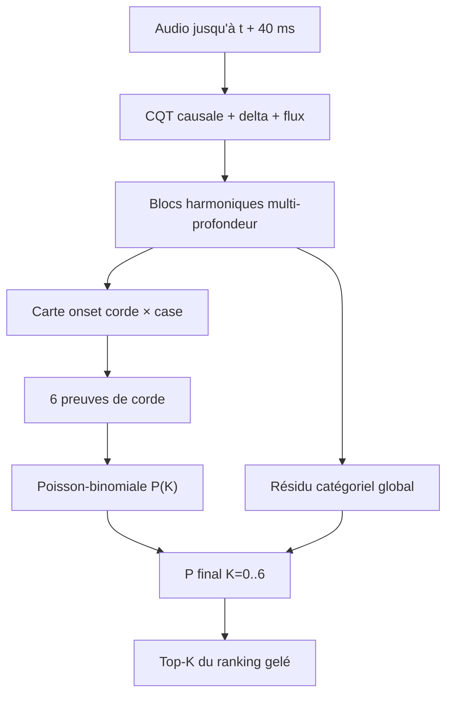

# V28 — Recherche approfondie pour un nouveau modèle de comptage polyphonique

Date de la recherche : **2026-09-09**

Priorité du projet : **exact-K polyphonique sur les clusters d'onsets (`K >= 2`)**

Référence de développement conservée : **V27.3**
Statut : **V28.0-A/B et smoke synthétique validés ; aucun entraînement GuitarSet/outer lancé**

## Verdict

La prochaine expérience ne doit être ni un nouveau seuil, ni un routeur, ni une
autre tête ordinale posée sur les mêmes 64 bandes de V10–V27. Le dépôt a déjà
exploré ces familles et l'oracle qui choisit, ligne par ligne, parmi les experts
de comptage existants ne monte qu'à **56,0047 %** d'exact-K polyphonique.

La meilleure piste trouvée est un nouveau modèle **V28 Causal Harmonic Evidence
Counter**, abrégé **V28-CHEC** :

1. une représentation CQT alignée sur les hauteurs, à 3 bins par demi-ton ;
2. des canaux de changement spectral dédiés aux nouveaux onsets ;
3. plusieurs blocs de convolution harmonique *shift-and-aggregate*, inspirés de
   **Harmonica** mais réimplémentés et entraînés proprement ;
4. une carte d'onsets par corde et case, afin de conserver les unissons ;
5. six probabilités de naissance de corde transformées en distribution
   Poisson-binomiale exacte sur `K=0..6` ;
6. un résidu catégoriel global qui apprend les dépendances entre cordes ;
7. le ranking temporel existant, gelé, pour réaliser les `K` événements.

La nouveauté déterminante n'est pas la formule Poisson-binomiale — déjà testée
dans le dépôt — mais **l'information acoustique locale par hauteur et par
harmonique qui lui manquait**. Le papier Harmonica, déposé cinq jours avant
cette revue, apporte l'évidence la plus directe : à budget comparable, la
convolution harmonique multi-profondeur bat le stacking harmonique, l'attention
harmonique et une convolution harmonique appliquée une seule fois.[^harmonica]

Cette piste est **prometteuse**, mais aucun résultat publié ne permet de promettre
80 % d'exact-K selon notre définition. Les articles publient surtout du F1 de
notes ou de trames, métriques qui ne demandent pas que toutes les notes d'un
cluster aient simultanément le bon compte.

Mise à jour d'implémentation : le [front-end causal](./v280-causal-features-implementation.md)
et le [graphe du compteur](./v280-harmonic-count-graph-implementation.md) sont
implémentés. Le smoke TensorFlow synthétique a réussi avec 110 402 paramètres et
une loss totale passée de 6,2779 à 0,3408. Aucun dataset ou checkpoint externe
n'a été ouvert par ce smoke.

## 1. Point de départ vérifié dans le dépôt

### 1.1 Référence et distance à 80 %

V27.3 reste la référence formelle : **4 005 / 9 401 = 42,6019 %** de lignes
polyphoniques exactes. Son gain sur V27.1 n'est que de deux lignes et ne constitue
pas un saut robuste ; le fold 0 a perdu 49 lignes exactes et le F1 événementiel a
baissé de 0,1857 point. Voir le [rapport V27.3](./v273-selective-transition-corrector-results.md).

Atteindre 80 % exige au minimum `ceil(0,80 × 9 401) = 7 521` lignes exactes :

- corrections nettes encore nécessaires : **3 516** ;
- erreurs actuelles à récupérer sans régression : **65,16 %** ;
- meilleur oracle des experts V10.4/V26 : **5 265 / 9 401** ;
- même cet oracle laisse **2 256** lignes supplémentaires à résoudre pour
  atteindre 80 %.

Ce calcul ferme la piste « mieux choisir entre les experts existants ».

### 1.2 Le ranking n'est pas le verrou principal

L'audit V24 couvre 76 768 lignes et 240 pistes une seule fois en outer-clean.
Avec le vrai `K`, le ranking gelé atteint environ **0,973 de F1 à 50 ms**, contre
0,798 lorsque le compte prédit est utilisé. L'exact-K polyphonique du compte
catégoriel V24 n'était que **36,2302 %**. Voir l'[audit V24](./v240-final-audit.md).

La décision rationnelle est donc :

- garder le mécanisme de candidats/ranking pour l'identité et le temps ;
- remplacer le signal acoustique de comptage ;
- évaluer V28 d'abord comme expert indépendant, avant toute fusion avec V27.3.

### 1.3 Erreurs à cibler

Sur V27.1, avant le très petit correctif V27.3 :

| Vrai K | Lignes | Exact | Sous-comptage | Sur-comptage |
|---:|---:|---:|---:|---:|
| 2 | 4 279 | 49,29 % | 27,32 % | 23,39 % |
| 3 | 2 952 | 37,43 % | 40,96 % | 21,61 % |
| 4 | 1 628 | 42,51 % | 51,41 % | 6,08 % |
| 5 | 438 | 19,86 % | 76,94 % | 3,20 % |
| 6 | 104 | 9,62 % | 90,38 % | 0,00 % |

Le modèle doit donc distinguer `2↔3↔4`, mais surtout révéler les attaques faibles
masquées dans les accords `K>=4`. Un simple rééquilibrage de classes ne crée pas
cette information.

### 1.4 Ce qui a déjà été essayé

Les branches V9–V27 couvrent déjà : catégorie exacte, ordinal conditionnel, six
têtes de cordes, cross-attention par corde, assignation source-temps,
Poisson-binomiale, décodeurs de sets, slot attention, propositions denses,
ranking de sous-ensemble, pondération de classes, fusion et correcteurs de
transitions. Une proposition V28 qui ne change que la loss ou le routeur
répéterait donc une expérience fermée.

## 2. Revue des familles de modèles existantes

### 2.1 Tableau de décision

| Famille | Signal et sortie | Résultat publié pertinent | Causalité / coût / fuite | Décision pour V28 |
|---|---|---|---|---|
| **TabCNN** (2019)[^tabcnn] | CQT 2 bins/demi-ton, contexte centré de 9 trames, 6 cordes × 21 états | F1 multipitch 0,826 sur GuitarSet | Contexte futur ; entraîné sur GuitarSet | La factorisation par corde est juste, mais V9.2/V10.1 en ont déjà testé des variantes avec le signal actuel |
| **FretNet** (2023)[^fretnet] | HCQT : sous-harmonique 0,5 + fondamentale + harmoniques 2–5 ; onset + corde/case + déviation de hauteur | F1 note sans corde 0,664 ; code MIT | 9 trames de contexte ; entraîné en CV sur GuitarSet | Confirme l'intérêt HCQT/onset/cordes ; ne suffit pas comme modèle à copier tel quel |
| **Basic Pitch** (2022)[^basic-pitch] | CQT 3 bins/demi-ton, 7 harmoniques + 1 sous-harmonique ; onset/note/multipitch | 16 782 paramètres ; F1 notes GuitarSet 0,79 dans son protocole | Léger, mais son entraînement contient 648 exemples GuitarSet | Bonne preuve d'architecture ; checkpoint interdit pour nos folds |
| **HPPNet** (2022)[^hppnet] | CQT 48 bins/octave, convolutions dilatées harmoniques, LSTM groupé par fréquence | 151 k à 1,2 M paramètres ; très fort sur piano | BiLSTM et domaine piano | Source des blocs harmoniques ; rendre le temps causal et spécialiser guitare/onsets |
| **High-resolution CRNN + GAPS** (2024)[^gaps-paper][^highres-guitar] | Log-mel, CRNN, onset/offset/frame/velocity par hauteur | F1 onset GuitarSet zéro-shot **88,1 %** avec GAPS seul ; jusqu'à 91,2 % supervisé | Environ 20 M, fenêtres 10 s, non déployable en faible latence | Excellent **teacher diagnostique** sans GuitarSet, pas le student final |
| **SynthTab** (2024)[^synthtab-paper] | Préentraînement de TabCNN sur guitare synthétique | Améliore les transferts entre jeux | Près de 2 To ; CC BY-NC ; ~3,6 % des heures touchées par un bug de notes répétées | Pas de téléchargement massif ; éventuellement un sous-ensemble nettoyé plus tard |
| **GOAT** (2025) | Guitares électriques DI + réamp, MIDI et tablatures | Modèle DI : F1 onset zéro-shot GuitarSet 0,860 | Accès sur demande, recherche seulement ; entraînement A5000 | Meilleure source externe pour les accords K=4–6, après autorisation |
| **Transformers / seq2seq** (MT3, YourMT3+, PerceiverTF, MuScriptor) | Événements symboliques avec long contexte | Bons scores supervisés pour certains ; MuScriptor va de ~100 M à 1,3 B | Lourds, non causaux, données immenses ; MT3 chute à 32 % en zéro-shot GuitarSet dans GAPS | Mauvais rapport coût/risque pour un compteur CPU spécialisé |
| **Harmonica** (2026)[^harmonica] | CQT 3 bins/demi-ton, convolution harmonique multi-profondeur, onset/sustain/offset | Medium 679 k : F1 onset GuitarSet 0,896 ; nano 26,3 k ; meilleur front efficacité/qualité du benchmark | Le protocole d'entraînement contient GuitarSet ; modèle publié non démontré causal ; aucun code public trouvé au 2026-09-09 | **Meilleure base architecturale**, à réimplémenter et réentraîner sans fuite |

### 2.2 Pourquoi Harmonica change la recommandation

Harmonica utilise deux blocs ResNet en entrée, réduit une CQT de 3 bins par
demi-ton à un bin par demi-ton, puis répète à plusieurs profondeurs une opération
qui décale la carte selon sept harmoniques et sept sous-harmoniques, concatène
les copies et les agrège avec une convolution `1×1`.[^harmonica]

Sur un même modèle medium et trois seeds, l'ablation publiée donne :

| Agrégation harmonique | F1 onset+pitch | F1 onset+pitch+offset | F1 trame |
|---|---:|---:|---:|
| Aucune | 0,822 | 0,635 | 0,823 |
| Stacking à l'entrée | 0,851 | 0,688 | 0,848 |
| Attention multi-profondeur | 0,877 | 0,737 | 0,868 |
| Convolution une profondeur | 0,877 | 0,731 | 0,867 |
| **Convolution multi-profondeur** | **0,889** | **0,745** | **0,876** |

Ce résultat vise précisément notre failure mode : plusieurs séries harmoniques
se chevauchent et une note faible est confondue avec l'harmonique d'une autre.
Le sous-harmonique est également important : Deep Salience l'introduisait déjà
pour distinguer une fondamentale de son premier harmonique.[^deep-salience]

La taille est compatible avec notre contrainte CPU : 26,3 k, 137 k, 679 k,
3,2 M et 15,1 M paramètres selon l'échelle. Le modèle medium est annoncé à 7×
temps réel sur CPU d'iPhone 15 Pro Max, avec 382,6 Mo de pic mémoire, mais cette
mesure ne prédit ni notre coût de CQT ni le temps d'entraînement sur Mac M4.
Un benchmark local reste obligatoire.

Deux limites empêchent d'utiliser Harmonica directement :

1. son entraînement multi-source inclut 480 enregistrements GuitarSet plus un
   petit holdout de développement ; un éventuel checkpoint contaminerait nos
   folds ;
2. le papier évalue des chunks de 5 secondes avec recouvrement central et ne
   démontre pas une exécution causale à 40 ms.

### 2.3 Ce que les données externes enseignent

GuitarSet ne contient qu'une guitare et six interprètes.[^guitarset] GAPS apporte 14 heures,
300 performances, 259 410 notes et plus de 200 interprètes dans des conditions
d'enregistrement variées.[^gaps-paper] Un modèle entraîné sur GAPS seul atteint
88,1 % de F1 onset sur tout GuitarSet en zéro-shot, contre 32,0 % pour MT3 dans
le même tableau.[^gaps-paper] Le gain semble donc venir autant de la diversité
réelle que de la taille du réseau.

GOAT apporte le complément absent de GAPS : guitare électrique et beaucoup
d'accords denses. Il contient 13 538 accords, dont 4 260 à quatre notes, 1 065 à
cinq et 1 039 à six.[^goat] C'est particulièrement pertinent pour les 542 lignes
`K=5/6` de notre développement, aujourd'hui très sous-comptées.

En revanche :

- GAPS est limité à la recherche non commerciale, avec permission non
  transférable ;[^gaps-site]
- GOAT est distribué sur demande pour un usage de recherche ;[^goat]
- SynthTab est CC BY-NC, proche de 2 To, et son dépôt documente un défaut de
  rendu qui touche environ 3,6 % du temps audio et plus de 80 % des morceaux
  pour certains rendus.[^synthtab-repo]

Aucune de ces données ne doit être téléchargée ou introduite dans le pipeline
sans validation explicite des conditions par l'utilisateur.

## 3. Architecture recommandée : V28-CHEC

### 3.1 Unité de décision et causalité

V28 reste un **expert de cluster**, pas un nouveau détecteur de flux :

- origine du cluster : premier candidat causal existant ;
- fin d'observation : `cluster_start + 1 764` échantillons, soit environ 40 ms ;
- aucun échantillon après cette fin ne peut entrer dans les features ;
- le temps de l'événement reste celui du candidat, comme dans V24–V27 ;
- l'émission physique du compte accepte donc le même délai de fermeture du
  cluster, sans futur supplémentaire.

Une CQT à 3 bins par demi-ton autour de E2 a un support théorique d'environ
0,62 s. Ce support est du **passé disponible**, pas du lookahead. V28 conserve
au moins 0,65 s d'historique et aligne toutes les fenêtres à droite. L'option
centrée par défaut de bibliothèques CQT est interdite.

Tests causaux obligatoires :

- modifier tout échantillon après `cluster_start + 1 764` ne change aucun logit ;
- le calcul piste entière et le calcul par chunks donnent les mêmes tenseurs ;
- un impulse-test vérifie l'horodatage exact et l'absence de centrage caché ;
- le padding de début de piste ne produit aucune naissance artificielle.

### 3.2 Entrée temps-fréquence

Configuration initiale proposée :

| Élément | Valeur initiale |
|---|---|
| Audio | mono 44,1 kHz, inchangé |
| Pas temporel | 256 échantillons, soit 5,80 ms |
| Axe CQT | 3 bins par demi-ton |
| Plage de sorties | MIDI 40–83, E2 à B5, correspondant aux 20 positions × 6 cordes de GuitarSet |
| Plage spectrale interne | étendue jusqu'aux harmoniques utiles sous Nyquist ; positions hors plage masquées |
| Historique | au moins 0,65 s, calculé de façon right-aligned |
| Futur maximal | les 40 ms déjà autorisées par le cluster |
| Canaux | `log_magnitude`, hausse face au baseline pré-cluster, flux positif |

Le cache doit être **par piste**, en float16, avec des indices de crops par
cluster. Dupliquer une longue CQT pour chacune des 76 768 lignes multiplierait
inutilement le stockage et les lectures.

### 3.3 Tronc harmonique

Commencer avec l'échelle proche de Harmonica-small :

- entrée ResNet légère ;
- canal interne `c2=32` ;
- trois blocs `harmonic shift-and-aggregate + ResNet` ;
- décalages déterministes correspondant à sept harmoniques et sept
  sous-harmoniques ;
- normalisation par instance ;
- convolutions temporelles à padding causal ;
- tête temporelle par fréquence avec GRU unidirectionnel partagé ou TCN causal.

Le noyau Harmonica-small compte environ 137 k paramètres dans l'article. Nos
têtes corde/case et K l'augmenteront ; la cible pratique V28.0 est **moins de
300 k paramètres**. Une variante proche du medium, sous 1 M, ne sera envisagée
que si le petit modèle sous-apprend sur les partitions internes.

### 3.4 Sorties qui rendent le compte identifiable

Le tronc produit trois niveaux de preuve :

1. `O_sf[t,s,f]` : onset par temps, corde et case (`6×20`) ;
2. `q_s` : probabilité qu'au moins une nouvelle note appartienne à la corde `s`
   dans le cluster ;
3. `r_k` : résidu global catégoriel pour `K=0..6`.

La sortie corde/case est préférable à une simple carte MIDI : deux cordes
peuvent produire la même hauteur. Une carte uniquement par hauteur fusionnerait
ces unissons et imposerait artificiellement `K-1`.

Les six `q_s` donnent exactement une distribution Poisson-binomiale :

\[
P_{PB}(K=k) = [z^k]\prod_{s=1}^{6}((1-q_s)+q_sz).
\]

Le modèle final ajoute les dépendances entre cordes sans abandonner cette base
interprétable :

\[
P(K)=\operatorname{softmax}(\log(P_{PB}(K)+\epsilon)+r_K).
\]

Le compte émis est `argmax P(K)`. Aucun seuil de présence ne décide `K`.

### 3.5 Supervision

Objectif principal : cross-entropy catégorielle sur le vrai `K`. Objectifs
auxiliaires :

- BCE sparse sur la carte d'onsets corde/case ;
- BCE sur l'occupation des six cordes du cluster ;
- BCE sur une carte d'onsets MIDI obtenue en repliant corde/case ;
- pénalité légère de cohérence entre le `P(K)` final et `P_PB(K)`.

Point de départ avant sélection interne :

\[
L = L_K + 0{,}25L_{corde} + 0{,}15L_{corde\times case}
    + 0{,}10L_{pitch} + 0{,}10L_{cohérence}.
\]

Ces poids sont une proposition, pas des résultats. Ils doivent être figés dans
le protocole avant toute lecture des folds outer. Une seule ablation interne
`sans blocs harmoniques` permet de vérifier que le gain vient bien du nouveau
signal ; les outer folds ne choisissent jamais l'architecture.

### 3.6 Échantillonnage et augmentation

- lots équilibrés par **groupe de composition**, puis présence garantie de
  lignes `K>=2` ;
- pas de nouvelle pondération inverse-fréquence non contrôlée : V26 a déjà
  montré ses compromis ;
- pitch shift `±2` demi-tons sur les partitions d'entraînement seulement ;
- EQ, bruit faible, gain et réverbération légère, à paramètres enregistrés ;
- aucune augmentation ne change `K` ni le temps des onsets ;
- aucune combinaison MixUp de deux clusters, car elle fabriquerait une cible de
  cardinalité et une acoustique non vérifiées.

## 4. Préflight recommandé avant l'entraînement V28

Le checkpoint exact du papier GAPS est publié sur Hugging Face sous le nom
`guitar-gaps-paper-version-12200_iterations.pth`, taille 99,3 Mo, SHA-256
`94a7c936ec9fde83686d29007dc256274384e832739cadece39e92cee3b69a7e`.[^gaps-checkpoint]
Il a été entraîné sans GuitarSet et peut donc servir de **teacher zéro-shot**
sur les 240 pistes de développement, à condition de ne jamais évaluer la
validation historique ou Locked12.

Ce test ne promeut pas le teacher : le modèle est lourd, hors causalité 40 ms et
sa licence de modèle MIT coexiste avec des conditions GAPS non commerciales qui
doivent être vérifiées. Il répond uniquement à la question : « une carte
d'onsets par hauteur contient-elle assez de signal complémentaire pour le
compte ? »

Pour chacun des cinq folds, les seuils éventuels sont calibrés uniquement dans
les quatre folds non-outer, puis appliqués une seule fois au fold outer. Publier :

- exact-K polyphonique direct du teacher ;
- exact-K par vrai K et matrice de confusion ;
- oracle de complémentarité `V27.3 ∪ teacher` ;
- nombre de corrections nouvelles et de régressions ;
- résultat pitch-collapsed et estimation séparée du plafond perdu aux unissons.

Porte d'investissement proposée, à figer avant le run :

- **GO V28 complet** si le teacher atteint au moins 55 % directement **et** si
  l'oracle avec V27.3 atteint au moins 70 % ;
- **zone grise** si un seul seuil est atteint : poursuivre seulement si `K>=4`
  progresse sur au moins quatre folds ;
- **STOP teacher/distillation** sous ces deux seuils ; la réimplémentation
  harmonique peut encore être testée, mais l'hypothèse d'un saut majeur est
  affaiblie.

Ce préflight nécessite l'autorisation explicite de télécharger le checkpoint.
Aucun fichier externe n'a été téléchargé pendant cette recherche.

## 5. Protocole outer-clean pour V28

### 5.1 Sélection imbriquée

Conserver exactement les cinq folds de groupes de composition utilisés depuis
V24 :

1. un fold outer totalement invisible ;
2. parmi les quatre autres, le plus petit identifiant comme meta-validation ;
3. les trois restants pour l'ajustement et le choix d'époque ;
4. réentraînement depuis zéro sur les quatre folds non-outer pendant le nombre
   d'époques choisi ;
5. une seule inférence sur l'outer ;
6. les cinq jobs peuvent s'exécuter séquentiellement, mais aucune décision ne se
   prend avant leur agrégation complète.

La validation historique et Locked12 restent non indexées. Les poids Basic
Pitch ou Harmonica sont interdits, car leurs données d'entraînement incluent
GuitarSet. Un teacher GAPS ne peut produire de pseudo-labels que sur la partition
d'entraînement du fold concerné.

### 5.2 Bras et comparaison

Le premier protocole doit rester court :

- **contrôle gelé** : V27.3 ;
- **traitement** : `V28-CHEC-direct`, son `argmax K` et le ranking V10.4/V24
  gelé ;
- **oracle diagnostique** : vrai K avec le même ranking ;
- aucune fusion V27.3/V28 pendant cette expérience.

Une fusion n'est justifiée que si V28 apporte d'abord un signal indépendant et
matériellement meilleur. Cela évite de transformer une nouvelle architecture en
nouveau correcteur post-hoc.

### 5.3 Métriques et règle de promotion

Métrique primaire : exact-K agrégé sur les 9 401 lignes où `K>=2`.

Diagnostics obligatoires :

- exact-K global ;
- exact-K, sous-compte et sur-compte pour chaque vrai `K` ;
- matrice de confusion `0..6` ;
- F1 événementiel à 5/10/20/50 ms et TP/FP/FN ;
- manque de candidats ;
- calibration NLL/Brier de `P(K)` ;
- paramètres, mémoire, temps CQT, temps réseau et latence par cluster sur CPU ;
- bootstrap par piste du delta d'exact-K, afin de ne pas traiter 76 768 lignes
  corrélées comme des observations indépendantes.

Après la promotion de deux lignes de V27.3, « strictement supérieur » n'est plus
un seuil matériel suffisant. Règle recommandée pour V28 :

1. exact-K polyphonique au moins **47,6019 %** (`+5,00` points absolus) ;
2. au moins quatre folds sur cinq strictement positifs ;
3. borne basse du bootstrap 95 % par piste supérieure à zéro ;
4. aucune utilisation de la validation historique ou Locked12 ;
5. le F1 événementiel reste secondaire et ne constitue pas un veto, mais toute
   variation est publiée sans omission.

Le seuil de 80 % reste un objectif de recherche, pas une règle de promotion de
la première itération.

## 6. Ordre d'exécution sûr et économique

1. **Geler le protocole V28** et les empreintes des caches V27.3.
2. **Implémenter uniquement les features** et les tests de causalité.
3. **Benchmark CPU borné** sur quelques pistes : temps, mémoire, taille du cache.
4. **Teacher GAPS zéro-shot**, uniquement après autorisation du téléchargement.
5. **Smoke training** V28 sur un mini-lot synthétique puis un petit sous-ensemble
   d'une partition interne ; vérifier gradients finis et surapprentissage d'un
   mini-lot.
6. **Ablation interne** multi-profondeur contre aucune agrégation harmonique.
7. **Cinq folds outer**, un job lourd à la fois, sans conclusion partielle.
8. **Agrégation et vérification indépendante** des NPZ, IDs, hashes et métriques.
9. **Export/live seulement après promotion** ; avant cela, V27.3 reste intact.

Si V28.0 améliore matériellement le compte mais reste loin de 80 %, V28.1 peut
ajouter un préentraînement externe ciblé : GOAT pour `K=4..6`, puis GAPS pour la
diversité de prises réelles. Le corpus SynthTab complet et les grands modèles
seq2seq ne sont pas des premières étapes compatibles avec le budget.

## 7. Risques à surveiller

| Risque | Effet possible | Garde-fou |
|---|---|---|
| CQT centrée ou padding `same` temporel | fuite de futur et score non déployable | impulse-test et invariance aux échantillons futurs |
| Métrique publiée différente | croire que 0,90 de F1 implique 90 % d'exact-K | mesurer notre exact-K directement, sans conversion |
| Unissons entre cordes | une carte MIDI sous-compte | sortie corde×case et six occupations |
| Rareté de K=5/6 | forte variance et surapprentissage | rapport par K, bootstrap par piste, données externes seulement après accord |
| Une seule guitare GuitarSet | faible généralisation | augmentations contrôlées puis GAPS/GOAT |
| Checkpoint entraîné sur GuitarSet | fuite silencieuse | interdire Basic Pitch/Harmonica préentraînés dans les résultats propres |
| Conditions GAPS/GOAT/SynthTab | usage ou redistribution non autorisés | validation humaine avant tout téléchargement |
| Checkpoint PyTorch pickle | chargement de code non sûr | vérifier SHA-256 et charger avec mode poids-seuls quand possible |
| Caches par ligne trop volumineux | stockage et I/O excessifs | cache CQT par piste, crops indexés |
| Décision après un fold favorable | biais de sélection | attendre les cinq folds et la synthèse figée |

## 8. Pistes rejetées comme prochaine expérience principale

- **Correcteur `3→2` seul** : l'effet V27.3 a été découvert après lecture des
  outer labels et ne crée aucune nouvelle preuve acoustique.
- **Nouvelle tête ordinale/conditionnelle sur V25/V26** : V25 et V27.2 ont déjà
  testé cette idée ; V27.2 a reculé à 41,0488 %.
- **Router plus complexe entre V10.4/V26/V27** : plafond oracle 56,0047 %.
- **Seuil sur des probabilités Bernoulli de candidats** : la confiance d'objet
  et la cardinalité ont déjà été découplées par V24.
- **MT3/YourMT3+/MuScriptor** : trop lourds, contextes longs, objectif beaucoup
  plus général que le nôtre ; MuScriptor-small est encore d'environ 100 M de
  paramètres.[^muscriptor]
- **Checkpoint Basic Pitch** : très léger mais entraîné avec GuitarSet, donc non
  recevable pour nos folds propres.[^basic-pitch]
- **Checkpoint Harmonica** : même fuite de données, et aucun checkpoint/code
  public reproductible n'a été trouvé à la date de cette recherche.
- **Télécharger SynthTab complet** : près de 2 To, bug documenté, licence NC.

## 9. Réponse à la question « cette piste peut-elle atteindre +80 % ? »

Elle est la première piste depuis V24 qui possède un **mécanisme plausible pour
créer l'information manquante** : séparer les fondamentales et harmoniques,
localiser chaque onset par hauteur, puis conserver la multiplicité des six
cordes. Les meilleurs modèles guitare atteignent 88–91 % de F1 onset sur
GuitarSet, et Harmonica-small/medium montre qu'une telle représentation peut
rester compacte.[^gaps-paper][^harmonica]

Mais la réponse scientifique demeure : **possible, non démontré et non
promissible**. Pour passer de 42,60 à 80 %, V28 doit corriger net 3 516 lignes ;
aucun article ne publie cette métrique stricte par cluster. Le teacher GAPS est
le moyen le moins cher de mesurer le plafond avant d'engager cinq entraînements.

## Sources

[^harmonica]: Longshen Ou et al., [*Harmonica: Accurate and Lightweight Instrument-Agnostic Music Transcription*](https://arxiv.org/pdf/2609.04640), prépublication soumise à ICASSP 2027, 4 septembre 2026.
[^basic-pitch]: Rachel M. Bittner et al., [*A Lightweight Instrument-Agnostic Model for Polyphonic Note Transcription and Multipitch Estimation*](https://arxiv.org/pdf/2203.09893), ICASSP 2022 ; [code officiel Basic Pitch](https://github.com/spotify/basic-pitch).
[^tabcnn]: Andrew Wiggins et Youngmoo Kim, [*Guitar Tablature Estimation with a Convolutional Neural Network*](https://archives.ismir.net/ismir2019/paper/000033.pdf), ISMIR 2019.
[^fretnet]: Frank Cwitkowitz et al., [*FretNet: Continuous-Valued Pitch Contour Streaming for Polyphonic Guitar Tablature Transcription*](https://arxiv.org/pdf/2212.03023), ICASSP 2023 ; [code officiel](https://github.com/cwitkowitz/guitar-transcription-continuous).
[^hppnet]: Weixing Wei et al., [*HPPNet: Modeling the Harmonic Structure and Pitch Invariance in Piano Transcription*](https://archives.ismir.net/ismir2022/paper/000085.pdf), ISMIR 2022.
[^deep-salience]: Rachel M. Bittner et al., [*Deep Salience Representations for F0 Estimation in Polyphonic Music*](https://archives.ismir.net/ismir2017/paper/000085.pdf), ISMIR 2017.
[^gaps-paper]: Xavier Riley et al., [*GAPS: A Large and Diverse Classical Guitar Dataset and Benchmark Transcription Model*](https://arxiv.org/pdf/2408.08653), ISMIR 2024.
[^gaps-site]: Queen Mary University of London, [site officiel et conditions d'utilisation GAPS](https://aim-qmul.github.io/GAPS/).
[^gaps-checkpoint]: Xavier Riley, [checkpoint GAPS correspondant au papier](https://huggingface.co/xavriley/midi-transcription-models/blob/main/guitar-gaps-paper-version-12200_iterations.pth) et [model card](https://huggingface.co/xavriley/midi-transcription-models).
[^highres-guitar]: Xavier Riley et al., [*High-resolution Guitar Transcription via Domain Adaptation*](https://arxiv.org/abs/2402.15258), ICASSP 2024 ; [site du projet](https://xavriley.github.io/HighResolutionGuitarTranscription/).
[^synthtab-paper]: Yongyi Zang et al., [*SynthTab: Leveraging Synthesized Data for Guitar Tablature Transcription*](https://arxiv.org/pdf/2309.09085), ICASSP 2024.
[^synthtab-repo]: Yongyi Zang et al., [dépôt officiel SynthTab, taille, licence et bugs connus](https://github.com/yongyizang/SynthTab).
[^goat]: Jackson Loth et al., [*GOAT: A Large Dataset of Paired Guitar Audio Recordings and Tablatures*](https://arxiv.org/html/2509.22655), ISMIR 2025 ; [code officiel](https://github.com/JackJamesLoth/GOAT-Dataset).
[^muscriptor]: Simon Rouard et al., [*MuScriptor: An Open Model for Multi-Instrument Music Transcription*](https://arxiv.org/abs/2607.08168), 2026 ; [code officiel MIT](https://github.com/muscriptor/muscriptor).
[^guitarset]: Qingyang Xi et al., [*GuitarSet: A Dataset for Guitar Transcription*](https://archives.ismir.net/ismir2018/paper/000188.pdf), ISMIR 2018 ; [dépôt officiel et erreurs connues](https://github.com/marl/guitarset).
